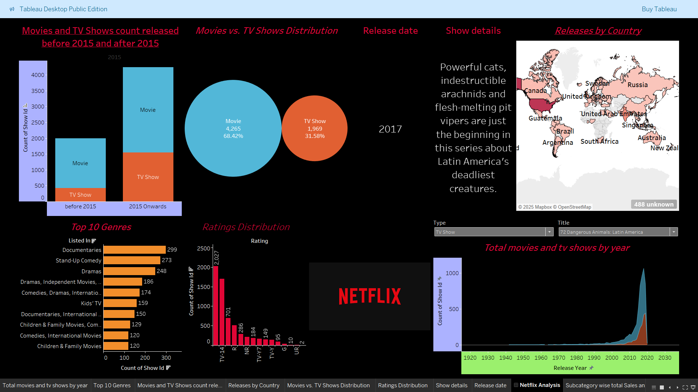

# 🎬 Netflix Data Analysis Dashboard (Tableau)

## 📌 Project Overview
This project explores and visualizes insights from a dataset of Netflix TV shows and movies. Built using Tableau, the dashboard highlights content trends, genre distribution, country-wise releases, ratings, and more. The goal is to uncover patterns in content production, genre popularity, and regional preferences to better understand Netflix's content strategy over time.

## 🛠️ Tools Used
- Tableau Desktop (Public Edition)
- Microsoft Excel
- Dataset: [Netflix Titles - Kaggle]([https://www.kaggle.com/datasets/shivamb/netflix-shows](https://www.kaggle.com/datasets/shivamb/netflix-shows))

## 📊 Key Visuals & Insights

- **Release Trends Before and After 2015**  
  Significant increase in content, especially TV shows, after 2015.

- **Movies vs. TV Shows**  
  Majority of titles are movies (~68%), rest are TV shows.

- **Country-wise Releases**  
  US, India, UK, and Canada are the top contributors.

- **Top 10 Genres**  
  Documentaries and Stand-Up Comedy are the most common genres.

- **Ratings Distribution**  
  TV-MA and TV-14 are the most frequent content ratings.

## 🖼️ Dashboard Preview

## 📂 Files

- `Netflix_Analysis.twbx`: Tableau packaged workbook containing two dashboards:
  - Netflix Data Analysis (main project)
  - Sample Superstore (included as an additional demo)
- `dataset/netflix_titles.xlsx`: Excel dataset used for dashboard creation
- `screenshots/netflix_dashboard.png`: Screenshot of Tableau dashboard used in this README

## 📥 Dataset Source

- Original dataset from Kaggle:  
  [Netflix Titles - Kaggle Dataset](https://www.kaggle.com/datasets/shivamb/netflix-shows)

## 👨‍💻 Author

**Hemant Mahajan**  
🎓 MSc Data Science 
 | ✉️ hemantmahajan1611@gmail.com

---

